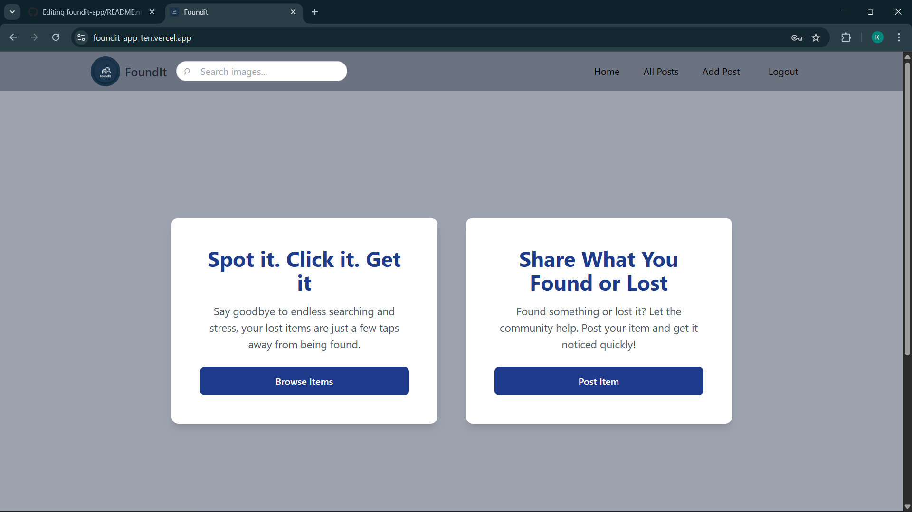
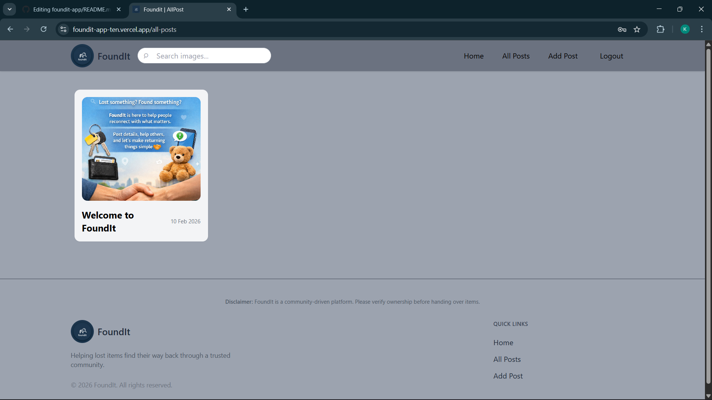
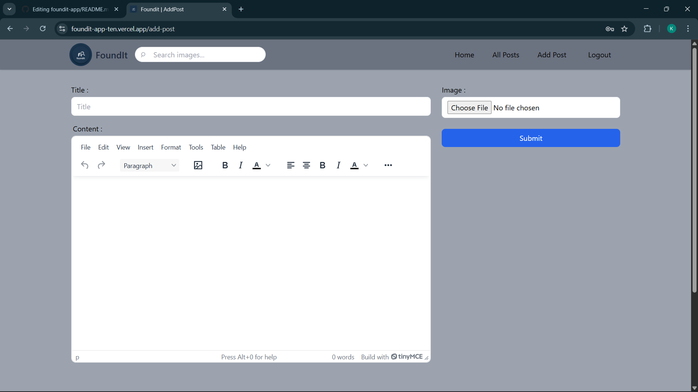
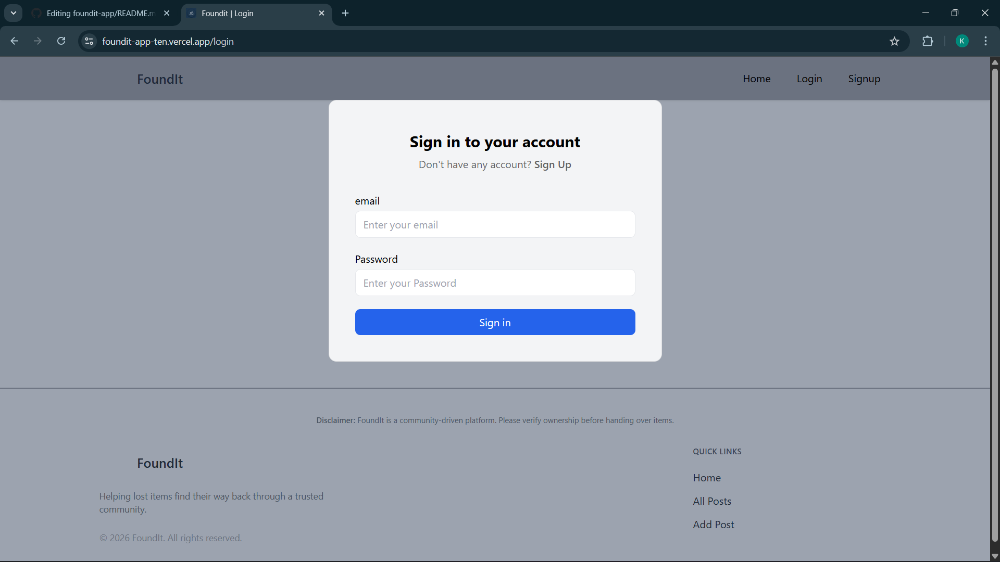

#  FoundIt — Lost & Found Platform

 **Live Demo:** https://foundit-app-ten.vercel.app/


## 📌 Overview
**FoundIt** is a full-stack web application that helps users report, search, and recover lost items through a community-driven platform. Users can create posts for lost or found items, upload images, search listings.


## 🚀 Features

- 🔐 User Authentication (Signup / Login / Logout)
- 📝 Create, Edit, Delete Posts (CRUD)
- 🔎 Search items by title
- 🖼 Image upload with preview
- 📱 Fully responsive UI


## 🛠 Tech Stack

### Frontend
- React.js
- Tailwind CSS
- Redux Toolkit

### Backend / Services
- Appwrite
  - Authentication
  - Database
  - Storage

### Tools & Deployment
- Git & GitHub
- Vite
- VS Code
- Vercel (Hosting)


## 📂 Project Structure

```bash
src/
 ┣ components/
 ┣ pages/
 ┣ store/
 ┣ appwrite/
 ┗ App.jsx
```


## ⚙️ Installation & Setup

Install dependencies
```bash
npm install
```

Run development server
```bash
npm run dev
```

## 🔐 Environment Variables

Create `.env` file:

```
VITE_APPWRITE_URL=your_url
VITE_APPWRITE_PROJECT_ID=your_project_id
VITE_APPWRITE_DATABASE_ID=your_db_id
VITE_APPWRITE_COLLECTION_ID=your_collection_id
VITE_APPWRITE_BUCKET_ID=your_bucket_id
```


## 📸 Screenshots






## 📈 Learning Outcomes
- Built full-stack application using real backend service  
- Implemented authentication securely  
- Managed global state using Redux  
- Handled file uploads & storage  
- Structured scalable React project  
- Deployed production-ready app  


## 👨‍💻 Author
**Krishna Gopal**

